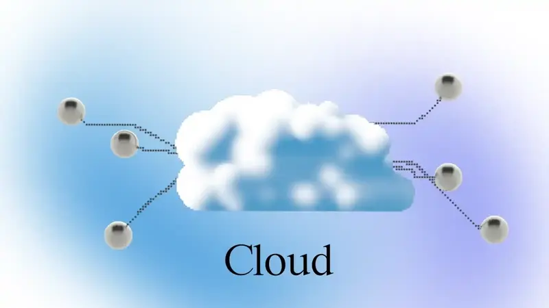
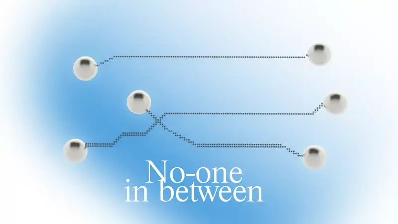

# ☁️ Интернет как наша Нервная Система: от Облака к Локальному-подходу


Облачная архитектура vs локальный-подход, сети, принадлежащие пользователям


### **С чего всё начинается**

Представьте себе на мгновение, что вы и все окружающие вас люди — это отдельные нейроны. На протяжении большей части истории человечества мы могли общаться с другими нейронами поблизости только через «синапсы» разговорного языка.

С изобретением письма мы обнаружили возможность соединить все эти нейроны. Наша скорость общения была медленной, а передаваемые сообщения — редкими. Иногда требовались столетия, чтобы такие трансформирующие идеи, как арабские цифры или гелиоцентризм, распространились по всему миру. Тем не менее, мы, одинокие нейроны, впервые стали глобально соединены.

С изобретением телеграфа, телефона, радио и телевидения скорость и качество наших связей значительно улучшились. Наша общая сеть стала сильнее и разнообразнее в своих сообщениях.

### **Интернет как наша суперсила**

А затем появился Интернет — квинтэссенция взаимосвязанности. Больше, чем когда-либо в истории человечества, большинство из нас подключено к нервной системе человечества.

Многие из нас проводят большую часть своего бодрствующего времени в Интернете. Мы можем транслировать свои мысли и чувства, общаться с другими нейронами и создавать сложные сети сотрудничества. Мы можем рассматривать эту цифровую нервную систему как нашу коллективную суперсилу.

#### **Интернет построен как прекрасный фундамент для этой нервной системы. Он децентрализован по своему замыслу — ни одна сторона не контролирует его.**

**Облако и его ограничения**

<figure><figcaption>
Облачная архитектура: где разработчики приложений становятся хранителями наших ключей
</figcaption></figure>

Проблема в том, что современный Интернет сильно зависит от облачных технологий, где клиентские приложения общаются друг с другом только через серверы. Это похоже на наличие сервера между любыми двумя нейронами в нервной системе, или на то, что каждый нейрон находится внутри коробки, которая решает, может ли сигнал от этого нейрона пройти.

В облачной архитектуре разработчики приложений хранят ключи от аккаунтов пользователей от их имени, то есть они становятся хранителями ключей. Это означает, что эти приложения теперь имеют возможность заглушать одних и продвигать других, блокировать и рекомендовать, решать, какая информация делится и распространяется в Интернете. Софтверные компании могут блокировать людей на основе их географического местоположения, случайных алгоритмов, личных убеждений своих основателей или акционеров, а также политической повестки влиятельных групп, с которыми они связаны.

В некотором смысле, теперь даже разные части этих нервных систем слабо связаны. Западный интернет. Китайский интернет. Российский интернет. Иранский интернет. И так далее. Они выглядят по-разному, но под ними лежит одна и та же структура власти — разные элиты с разными повестками контролируют, как нейроны общаются, какую информацию они видят и могут ли они вообще взаимодействовать.

Эта разделенность — не самая большая проблема; более опасно то, что в **каждой из этих версий Интернета нейроны не могут напрямую общаться и выражать себя друг другу**. Серверы контролируют наше общение с самыми близкими: членами семьи, соседями и местными сообществами.

Проблемы облачной архитектуры на этом не заканчиваются. Центральные серверы не только контролируют, кто и что может делать, но и этот контроль вездесущ. Даже когда вы отправляете сообщение члену своей семьи, сидящему рядом на диване, сигнал с вашего устройства на их устройство должен сначала пройти через сервер приложения, и только потом вернуться в вашу гостиную.

#### **Если этот центр выходит из строя или не отвечает, это означает, что даже ближайшие нейроны не могут общаться цифровым способом. Для биологического организма неработоспособная нервная система означала бы мгновенную смерть. Нервная система человечества нуждается в обновлении.**

### **Нервная система без посредников**

<figure><figcaption>
Anytype: Сеть без посредников
</figcaption></figure>

Есть части Интернета, где архитектура с серверным центром более эффективна — массовые онлайн-игры, сети типа Uber и другие примеры. Для роли, которую играет слой коммуникации, мы можем использовать подход лучше, чем облако.

Если мы проектируем нервную систему, которая будет устойчивой и гибкой, ей нужно другое подключение — когда нейроны напрямую соединяются друг с другом. Для этого мы должны передать ключи нейронам и по-другому соединить их — по принципам локального-подхода. Эту систему мы называем «сетью без посредников».

#### **Система без посредников — лучшая основа для семей, сообществ и объединений создателей.**

### **Как реализовать. Технологическая основа.**

Две технологии выглядят особенно впечатляюще, если представить их объединенную мощь. Эти технологии известны под малоизвестными названиями — Публичная Криптография и CRDTs.

**Публичная криптография** может защитить цифровые данные так, как это невозможно в мире атомов. Представьте себе, что у каждого из нас есть хранилище, в которое никто в мире не может проникнуть. Ни злонамеренный хакер, ни могущественное государство, даже если они объединятся. Это невозможно в мире атомов.

Используя публичную криптографию, мы можем создать ваше собственное хранилище, в котором будут храниться ваши данные и сообщения, и у которого есть два ключа: приватный и публичный. Зная ваш публичный ключ, любой может отправить зашифрованное сообщение, но только вы — владелец приватного ключа — сможете открыть хранилище и увидеть его содержимое. Все вычислительные ресурсы Земли не хватит, чтобы расшифровать одно сообщение. Генерация таких ключей не стоит денег и может быть выполнена на любом компьютере без подключения к интернету. Создание хранилищ и авторизация могут быть полностью независимыми. Это означает, что каждый нейрон может быть цифрово независимым.

#### **Когда у нас есть независимые хранилища с нашими ключами, мы можем позволить хранилищам общаться между собой по принципам локального-подхода. Здесь вступают в игру CRDTs.**

В традиционной облачной архитектуре (также известной как клиент-сервер) все клиенты должны подключаться к серверу, на котором хранится основная копия данных. Этот сервер разрешает потенциальные конфликты, когда клиенты работают с одной и той же информацией, особенно в реальном времени.

Если мы хотим изменить подключение на локальный-подход, нам нужен способ разрешения конфликтов всеми клиентами независимо, чтобы клиент не зависел от сервера для этого. Это нелегко, так как мы не можем контролировать, какие устройства в сети, а какие нет.

К счастью, есть новая технология, называемая **CRDTs (бесконфликтные реплицируемые типы данных)**, которая позволяет достигать одинакового состояния независимо от порядка, в котором получены изменения, так что каждое устройство может разрешать конфликты независимо — без зависимости от единой основной копии.

Публичная криптография широко реализована. Пока что в основном в криптокошельках. CRDTs, с другой стороны, это свежий подход, появившийся в информатике в 2011 году и в основном реализованный в экспериментах и исследованиях.

### **Реализация**

Поэтому наша команда в Anytype работает над объединением обоих подходов в новый протокол локального-подхода, основанный на ключах создателей. Он называется AnySync и поддерживает высокопроизводительную и масштабируемую синхронизацию объектов, обсуждений, сообществ и приложений, которые не зависят от облака. Подробнее о нашем протоколе синхронизации можно прочитать [здесь](https://github.com/anyproto/any-sync?ref=blog.anytype.io).

Anytype — это интерфейс к хранилищам, описанным в этой статье: зашифрованным, основанным на локальном-подходе и с ключами, контролируемыми создателями. Это значит, что в Anytype никто не стоит между вами и вашим хранилищем, между вами и вашими контактами, или между вашими устройствами, и эти хранилища общаются друг с другом по принципам локального-подхода.



### **Будущее**

Применяя это к дизайну веба, мы стремимся создать систему, в которой можно делать всё оффлайн и в локальных сетях, а подключение к интернету будет опциональным. Это поможет нейронным группам стать более устойчивыми и быстрыми. Мы приглашаем других присоединиться в качестве соавторов, чтобы вместе построить локальную версию Интернета.

#### **Будущее будет таким, каким вы его создадите.**

**Источники**

1. Маршалл Маклюэн. Понимание Медиа, 1964.
2. Новые Направления в Криптографии, 1976.
3. Бесконфликтные Реплицируемые Типы Данных (CRDTs), 2011.

***

[\*Изначально опубликовано на Anytype](https://anytype.io/files/the-nervous-system-of-humanity-needs-an-upgrade.html?ref=blog.anytype.io) — приложение для всех, кто ценит доверие и автономию.\*

**Первоисточник:**



