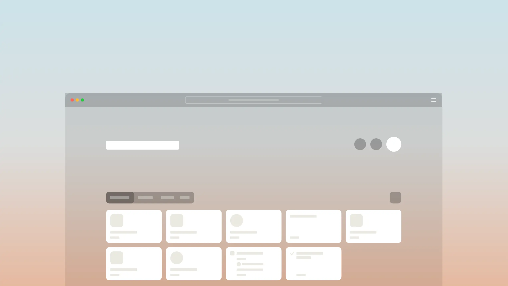

# ⚙️ Мы не просто сортируем скрепки…

<figure><figcaption></figcaption></figure>

Добро пожаловать в сентябрьское обновление платформы. Мы прошли долгий путь за последний год. Альфа-версия Anytype теперь доступна для Android, iPhone, Linux, macOS и Windows. С каждым обновлением наше сообщество растет, и, честно говоря, новостей слишком много!

Теперь у нас есть два ежемесячных обновления. Это обновление платформы будет отражать наш прогресс каждый месяц, выделяя обновления для настольных и мобильных приложений, и как это стало возможным благодаря нашей технической инфраструктуре.

#### **Прочитайте обновление сообщества за этот месяц:**


Прочитайте сентябрьское обновление сообщества.


***

#### **Значительное обновление для ваших объектов.**



Anytype теперь поддерживает совершенно новые типы объектов, которые связаны в граф знаний. Вы можете создавать новые объекты с макетами, отношениями и шаблонами для повторного использования. Что самое важное, теперь вы можете работать с несколькими объектами, создавая таблицы (и вскоре) списки и галереи.

Спасибо всем, кто участвовал в вводных звонках, делился своим отзывами и творениями. Благодаря вашим вкладом этим летом мы можем предоставить это обновление всем участникам альфа-программы.

#### **Узнать больше:**


Узнайте больше о нашей новой метафоре.


***

#### **Значительное обновление для ваших карманов.**


Anytype для iPhone начал альфа-тестирование с новой группой из 100 пользователей.


#### **Anytype для Android теперь поддерживает типы, наборы и отношения.**

Последняя версия Anytype для Android содержит множество улучшений, которые помогут вам быстрее создавать и работать с вашими объектами.

Этот выпуск также принес поддержку наборов, отношений и типов на мобильные устройства. Спасибо всем пользователям за тестирование этих новых функций этим летом.

[Узнайте больше о последней версии в наших заметках о выпуске.](https://community.anytype.io/knowledgebase/959-anytype-android-030-released?ref=blog.anytype.io)

#### **Отправлено с моего iPhone**


YouTube: Anytype на iPhone


В сентябре мы выпустили нашу первую версию Anytype для группы из 100 пользователей.

Наша первая версия полностью поддерживает все текстовые блоки Anytype, наше популярное меню больших стилей в тексте, встроенные медиа, макеты и другие богатые функции, которые помогают сделать ваши объекты вашими.

Anytype для iOS будет постепенно доступен большему числу альфа-тестеров в ближайшие недели. В ближайшие месяцы мы добавим поддержку многострочного выбора блоков внутри холста и полную поддержку типов, наборов и отношений.

#### **Узнать больше:**


Узнайте больше о Anytype для iPhone.


**Первоисточник:**\
[https://blog.anytype.io/platform-september-2021/](https://blog.anytype.io/platform-september-2021/)
