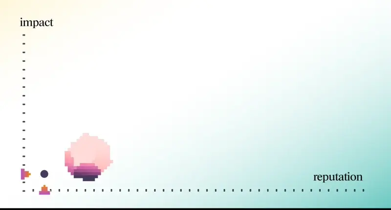

# Наша философия членства


Сеть Anytype: сеть независимых пространств, управляемая её со-создателями, разработчиками и участниками


По мере того, как мы готовимся к скорому запуску многопользовательского режима и сети Anytype, мы рады поделиться философией нашего членства, первой версией наших планов членства и тем, как мы видим развитие членства в будущем.

### **Наша философия членства**

Anytype как программное обеспечение был создан для распространения цифровых свобод: свободы мысли и самовыражения, свободы общаться с теми, кому мы доверяем, и свободы участвовать в управлении нашими цифровыми творениями. Мы считаем, что _делая эти свободы неотъемлемыми_, мы создаем основу, на которой могут строиться здоровые и устойчивые сообщества и общества.

Для достижения этой цели нам нужно было разработать программное обеспечение таким образом, чтобы его мог использовать любой человек, независимо от происхождения, национальности или финансовых возможностей. Именно поэтому Anytype как инструмент всегда будет бесплатным, если вы используете его с собственными ресурсами (локальное хранилище, локальная или собственно хостинговая сеть).

В то же время мы стремимся сделать разработку Anytype устойчивой. Для этого мы вводим сеть Anytype: сеть со-создателей, разработчиков и участников Anytype.

Эта сеть объединяет независимые пространства и профили, создавая сумму, которая значительно превосходит свои части. При правильном уходе и управлении эта сеть станет нашим общим ресурсом, общим источником истины и коллективной средой для реализации цифровых свобод, к которым мы стремимся.

_💥 **Мы тепло приглашаем вас присоединиться к нам и управлять этой сетью вместе с нами через нашу программу членства.**_

### **Причины стать участником сети**

Существует несколько причин присоединиться к сети Anytype:

* Для доступа к ресурсам сети, включая синхронизацию сети и удаленное хранилище для личных и общих пространств.
* Для владения уникальным децентрализованным именем, по которому другие смогут найти вас в сети. Ваше имя — это цифровой актив, который никто не сможет отобрать у вас.
* Для создания сообществ, которые будут уникально вашими, и которые вы сможете развивать с помощью сети.
* Самое главное, членство означает, что вы участвуете в построении сети, основанной на цифровых свободах. Как со-создатель этой сети, вы будете участвовать в управлении сетью вместе с нами. Будучи членом, вы получите уникальный значок, отражающий вашу раннюю поддержку, — этот значок даст вам эксклюзивный доступ к мероприятиям для членов, коммуникациям и решениям по управлению.

#### **Планы членства в сети Anytype**


Планы членства в сети Anytype, весна 2024 года


Подробности различных планов членства можно найти в [разделе документации о членстве](https://doc.anytype.io/anytype-docs/memberships-and-pricing/monetization?ref=blog.anytype.io).

Все пользователи Anytype, как члены, так и не члены, всегда будут иметь доступ к следующему:

* Хранилище на устройстве
* P2P-синхронизация
* Шифрование с нулевым разглашением

Текущие бета-пользователи Anytype (те, кто присоединился до запуска членства), автоматически получат доступ к плану Explorer. Эксклюзивные скидки также будут предложены нашим бета-пользователям в знак благодарности за то, что они присоединились к Anytype до запуска членства.

### **Независимая сеть, построенная на общем доверии**

Вы можете представить сеть Anytype как большой граф пространств, где можно искать публичные пространства и профили. Это уже существует в текущем интернете в формате веб-сайтов (пространств) и социальных сетей (профилей).

Каждое пространство и профиль в сети Anytype являются цифрово независимыми. Владельцы пространств имеют полный контроль над своими ключами, управляют своей социальной сетью, выбирают поставщика хостинга и правила взаимодействия в своих пространствах. В будущем владельцы пространств смогут вводить собственные планы членства или модели монетизации для каждого из своих пространств.


Сеть требует слоя консенсуса для координации цифрово независимых пространств


Когда эти пространства и профили подключаются к сети, они требуют единого источника истины — слоя консенсуса, который хранит информацию, управляющую поиском пространств и профилей. Эта информация включает:

* Кто владеет каким именем
* Кто имеет доступ к общим пространствам
* Какие пространства и профили относятся к каким категориям
* Управление поиском пространств

### **Управление сетью: Репутация и Карма**

На данный момент управлением сети Anytype руководят основатели. По мере роста сети мы планируем децентрализовать её управление к нашему сообществу со-создателей. Для этого мы введем понятия Репутации и Кармы.

**Репутационные баллы** — это передаваемые баллы, которые можно заработать за вклад в развитие сети и обменивать между членами после запуска сети. Члены будут получать репутационные баллы за успешные приглашения новых участников, создание кода, документации и других типов вкладов.

Репутационные баллы можно использовать для доступа к ресурсам сети: продления или обновления членства, приобретения новых имен, записи в едином источнике истины и публикации пространств и профилей в категориях.

**Карма** — это непередаваемые баллы, которые отражают, сколько репутационных баллов заработал участник (а не обменял). Это показатель того, сколько участник вложил в развитие сети. Карму можно только заработать, её нельзя купить.

<figure><figcaption>
Управление в сети Anytype растет с вашими вкладом в сеть
</figcaption></figure>

Чем больше репутации и кармы набирают члены, тем больше их влияние на решения по управлению сетью. Это гарантирует, что те, кто продолжает вносить позитивный вклад в сеть, имеют большее влияние в её управлении.

### **Раннее членство уникально**

Члены, присоединившиеся к сети рано, получат больше репутационных баллов за вступление в сеть, чем те, кто присоединится позже. Ранние участники также получат карму просто за то, что они были первыми сторонниками сети на её начальном этапе.

***

Запуск членства и сети Anytype — это завершение многолетнего проекта. Мы с нетерпением ждем, в какой форме это реализуется, и приглашаем вас, наших преданных сторонников, присоединиться к нам в создании устойчивой, суверенной и богатой экосистемы.

\*\*\*\*💥 _**Мы с нетерпением ждем совместного построения будущего с вами.**_

**Первоисточник:**



