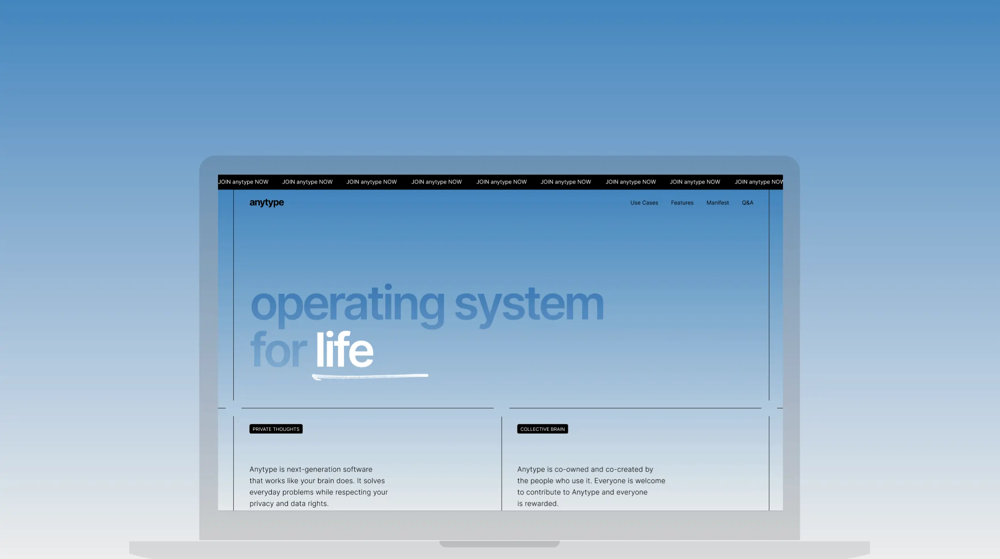

# 🏚️ Такие свежие и такие чистые

<figure><figcaption></figcaption></figure>

👋 Привет!

Добро пожаловать в сентябрьское обновление сообщества. Мы прошли долгий путь за последний год. Наша альфа-версия теперь доступна на всех основных платформах. С каждым новым добавленным функционалом наше сообщество растет, и, честно говоря, новостей так много, что для одного ежемесячного поста в блоге это слишком много!

Каждый месяц происходит так много удивительных событий, как в организации, так и в сообществе. 2 000 человек в нашей альфа-программе уже нашли место для Anytype в своей жизни. Я надеюсь выделить больше ваших невероятных вкладов с помощью этого нового блога (подробнее ниже) и этих обновлений.

#### **Прочитайте обновление платформы за этот месяц:**


Прочитайте обновление платформы за этот сентябрь.


***

#### **Наш новый дом в интернете**

У нас произошел экстремальный редизайн домашней страницы! Наш новый сайт был разработан талантливой, многократно награжденной [Еленой Сахаровой](https://eessoo.co/?ref=blog.anytype.io) и нашим руководителем по пиксельной точности Антоном Баруленковым. Вместе они создали что-то особенное и уникальное для нашего небольшого уголка интернета.

Совмещение нашего видения с реальными случаями использования — задача не из легких. Поэтому, чтобы не быть слишком многословным, я попросил Елену поделиться несколькими словами о дизайне.

> Я использовала сетку, которая визуально создает для пользователя открытый холст. Идеологически сетка также подчеркивает метафору блоков и объектов в Anytype. Как люди, мы все связаны в одной сети. Наши взаимодействия и общие переживания не должны зависеть от размеров экранов, которые мы выбираем. Наша сеть разделена между всеми, кто ею пользуется. Она распределена по одной поверхности, одной системе, той же самой сетке. Наконец, я хотела подчеркнуть противопоставление нового и старого. Сноски на черных полосах отсылают к нашим ранним операционным системам и временам, когда такие технологии, как peer-to-peer, только начинали появляться. Я хочу вновь вдохнуть жизнь в эти идеи.


Наш совершенно новый уголок интернета.


***

#### **anytype dot blog?**

Среди множества наших объявлений в этом сентябре потерялся запуск нашего нового блога. Это проект, над которым я работал некоторое время, и с помощью нашего нового руководителя сообщества я рад, что, наконец, его запустил.

В Anytype происходит так много отличных вещей как от моих коллег, так и от нашего сообщества. Я хочу, чтобы этот блог стал домом для ваших многочисленных вкладов, чем-то, на что мы можем ссылаться и чем можем гордиться.

Итак... Добро пожаловать в блог! 🥳

***

#### **Добро пожаловать, Дивьяншу!**

Наконец, я хочу официально поприветствовать [Дивьяншу](https://linkedin.com/in/div3xi?ref=blog.anytype.io) в команде Anytype.

Див — один из наших первых участников альфа-программы и наш первый руководитель сообщества. По мере того, как сообщество росло в течение этого года, Див был огромной помощью. Я очень рад, что он присоединился к команде и помогает сделать наше сообщество еще лучше.

**Первоисточник:**\
[https://blog.anytype.io/fresh-paint/](https://blog.anytype.io/fresh-paint/)
